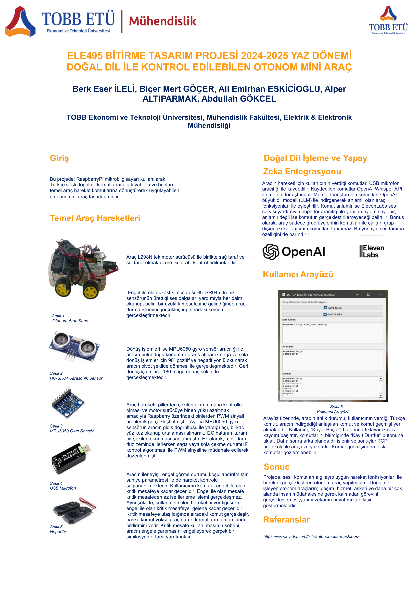

# Autonomous Vehicle Controlled by Natural Language Processing (NLP)
*B.Sc. Electrical & Electronics Engineering - Capstone Project (Team Suno)*

## 📌 About the Project
This repository contains the software and hardware architecture for an autonomous vehicle that can be directed using Natural Language Processing (NLP) commands. The project integrates embedded systems, real-time control mechanisms, and AI-based language models to achieve seamless human-machine interaction.
